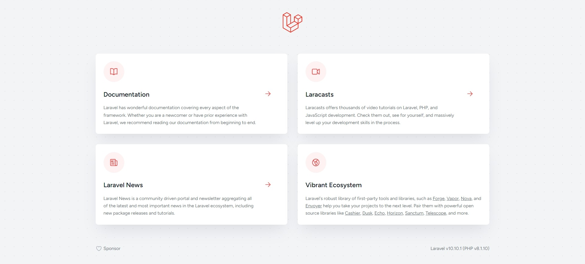

<h1 align="center">ostad_laravel_assignment_13</h1>

## Project Description:

Laravel Foundation is not a specific term or component in the Laravel framework. Laravel is a popular PHP framework that provides a robust and elegant toolkit for building web applications. It follows the Model-View-Controller (MVC) architectural pattern and includes various components and features that make development easier and more efficient.The framework has a rich ecosystem with additional packages and extensions that can further enhance your development experience.In Laravel, the core functionality and foundation are provided by the framework itself. 

## Installation And Setup Steps:

To install and set up the project locally, follow these steps.

1. At frist open any folder location and then open cmd there and run this commend: - composer create-project laravel/laravel example-app
2. And then when laravel project successfully installed then start on the local server. Laravel project starting commend write in cmd then start it. commend: - php artisan serve

## Folder Structure:

The folder structure of this Laravel project is as follows.

1. app: This folder contains the core application code, including models, views, and controllers.
2. bootstrap: The bootstrap folder holds the files responsible for bootstrapping the Laravel framework and initializing various components.
3. config: The config folder includes configuration files for the application, such as database settings, service providers, and application-specific configurations.
4. database: The database folder contains migrations, seeders, and factories for database-related operations.
5. public: The public folder serves as the document root for the application. It contains the entry point for HTTP requests and static assets like CSS, JavaScript, and images.
6. resources: The resources folder contains non-PHP files, such as views, language files, and frontend assets like Sass or JavaScript files.
7. routes: The routes folder contains route definition files for handling different types of requests.
8. storage: The storage folder stores files generated by the application, including logs, cache files, compiled views, and session data.
9. tests: The tests folder contains automated tests for the application using PHPUnit.
10. vendor: The vendor folder holds the dependencies installed via Composer.

<h2 align="center">Screenshots</h2>

## Insert screenshots from Part 1:

## Insert screenshots from Part 2:

## Github Repository Link:
github link: 
